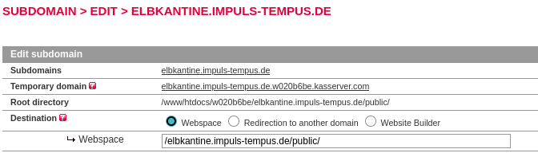
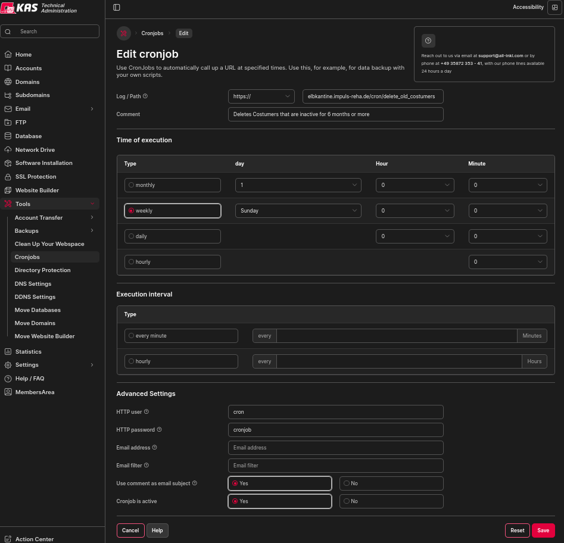
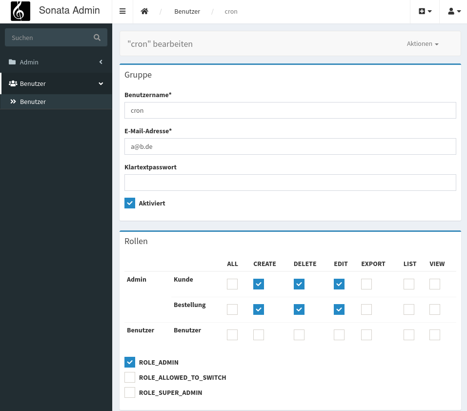

# Auf Server laden ohne ssh-zugang

Ohne ssh zugang können composer-dependencies nicht automatisch installiert werden können, müssen diese manuell via ftp hochgeladen werden.

Zu hochladenden Dateien/Ordner ohne ssh:
```
assets/
config/
public/
src/
templates/
translations/ (optional)
vendor/ (composer dependencies)
.env
.htaccess
composer.json
```


# Auf Server mit ssh-zugang installieren
reference: https://symfony.com/doc/current/deployment.html

### Dependencies installieren
Wenn ssh Zugang besteht 
```bash
git clone https://github.com/it4impuls/KantineApp_symfony.git
cd KantineApp_symfony
composer install --no-dev --optimize-autoloader
```
composer sollte bei jedem Webhoster vor-Installiert sein. Falls nicht, folge der Anleitung auf https://getcomposer.org/download/


### Secrets hochladen/setzen
Falls Secrets und decrypt key in `/config/secrets/prod/` von einer vorherigen installation vorhanden sind, lade diese auf den Server hoch. Die Dateien haben das Format `prod.{{secret_name}}.{{random_hex}}.php`, sowie `prod.decrypt.private.php`, `prod.encrypt.public.php`, `prod.list.php`.

Falls eines dieser Dateien nicht vorhanden ist, müssen die Secrets [neu generiert werden](https://symfony.com/doc/current/configuration/secrets.html#generate-cryptographic-keys):
```bash
APP_RUNTIME_ENV=prod php bin/console secrets:generate-keys
APP_RUNTIME_ENV=prod php bin/console secrets:set APP_SECRET --random
APP_RUNTIME_ENV=prod php bin/console secrets:set DATABASE_HOST      # addresse zur Datenbank
APP_RUNTIME_ENV=prod php bin/console secrets:set DATABASE_NAME      # Name der Datenbank
APP_RUNTIME_ENV=prod php bin/console secrets:set DATABASE_PASSWORD  # Passwort des Datenbank-Benutzers
APP_RUNTIME_ENV=prod php bin/console secrets:set DATABASE_USER      # Username des Datenbank-Benutzers
```

### Finalize

```bash
composer dump-env prod
APP_ENV=prod APP_DEBUG=0 php bin/console cache:clear
```

WICHTIG:

Webspace Directory muss in den public order zeigen!



Admin erstellen mit:
```bash
php bin/console sonata:user:create --super-admin {{username}} {{email}} {{password}}
```

# Cronjobs
Das löschen alter, inaktiver Teilnehmer läuft in einem cronjob. Dieser muss im all-inkl unter `Tools` -> `cronjobs` eingerichtet werden. https://all-inkl.com/wichtig/anleitungen/kas/tools/cronjobs/einrichtung_479.html:


Es muss ein Benutzer mit `Costumer delete` privilegien Angelegt werden und dessen login Informationen unter `advanced` abgelegt werden.


# Updating der Webseite
Änderungen in das `github.com/it4impuls/KantineApp_symfony` Repository pushen.
## Automatisch
Ein Automatischer Workflow sollte diese auf den Server Hochladen.
Auf https://github.com/it4impuls/KantineApp_symfony/actions kann überprüft werden, ob dies Erfolgreich war. Fehler können ebenfalls Überprüft werden woran es gescheitert ist.

## Manuell
Per ssh auf den Server loggen.
Änderungen pullen und cache clearen:
```bash
git pull
APP_ENV=prod APP_DEBUG=0 php bin/console cache:clear
```


# Import DB from django

## using ImportFromDjango.sql
Siehe Kommentare am Anfang von [ImportFromDjango.sql](ImportFromDjango.sql)